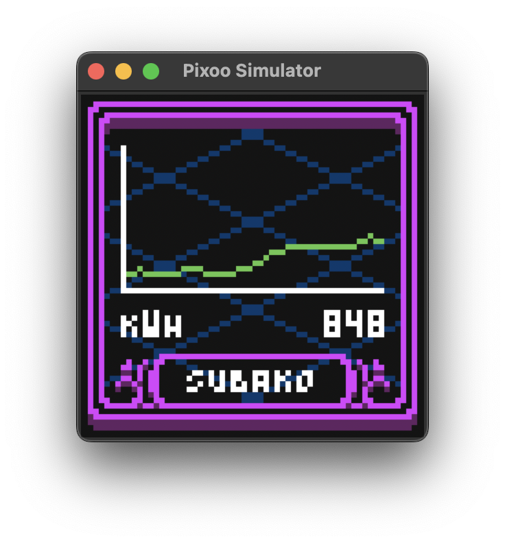
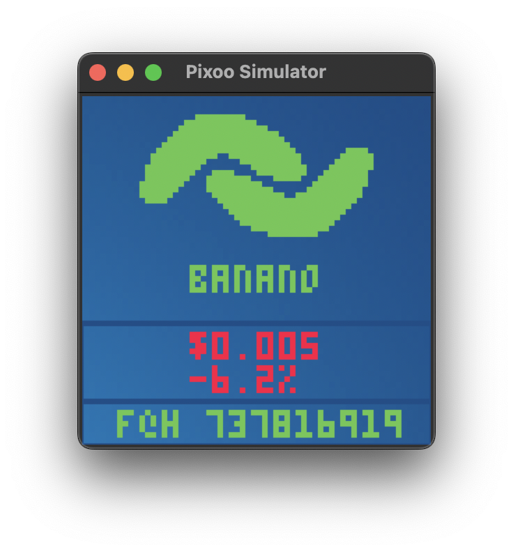

[![CC BY-NC-SA 4.0][cc-by-nc-sa-shield]][cc-by-nc-sa]

# Pixoo-Next

**pixoo-next** is an enhanced derivative of the original [pixoo library](https://github.com/SomethingWithComputers/pixoo) by [SomethingWithComputers](https://github.com/SomethingWithComputers/), released under the CC BY-NC-SA 4.0 License. It adds support for the recently released Divoom Pixoo 16 and Divoom Times Gate models in addition to the Divoom Pixoo 64 display supported by the original repository.

An non-trivial example, with re-connecting and API-calls can be found in `examples/power-usage`.
In this example I read the current kWh from my P1-meter and display the current power usage of my house in a neat little
graph.



_Tested on a Pixoo 64, with Python 3.12 on MacOS Sonoma._

## New features

### Added support for Divoom Pixoo 16 and Divoom Times Gate

The repository has now been optimized so that it works with these two recently released models.

The Pixoo 16 is a 16x16 version of the Divoom Pixoo 64. It lacks some API features such as adding text elements (you can only draw them using the draw_text method). As a result, using send_text or send_items to this model will result in an error. In addition, pushing a frame to the display will result in the screen going blank for a few moments. This is because pushing a frame does not work when a frame was previously pushed without switching to a different channel (see the "Known bugs" section below).

The Times Gate uses a series of five 128x128 matrices. It basically supports all API calls for the Pixoo 64. To control which screen to push the drawn frame, we have added an additional lcd_index parameter to the push, send_text, and send_items parameter that accepts an integer between 0 and 4 that corresponds to which matrix to update (0 being the leftmost screen and 4 being the rightmost screen; default is 0).

### The new save_frame method

With this method, you can create custom animated drawings. After you are done drawing a frame, you can save it by calling save_frame() and move on to drawing the next frame. This gets stored in a buffer and can be modified by specifying the index parameter inside of the save_frame method (0 corresponds to the first frame of the animation). When you are ready to display your entire animation, call the push method.

The push method also supports one additional parameter called 'speed'. This represents the number of ms to display each frame in the animation until it moves to the next frame. You can also call push directly without using the save_frame method if you plan on making static drawings.

To start over, call the clear_frames method.

### Dynamic text elements

You can now add automatically updating text elements (such as the time, date, and weather information) into the Pixoo 64 and Times Gate models using the add_item and send_items methods. Calling the add_item method will add a text item to the buffer. To display the text, call send_items. These methods also support more than 200 system fonts that Divoom uses for their clock faces.

We've also added an ItemType enum to make it easier for users to specify the type of text to be displayed.

### Additional draw_text parameters

The draw_text method now supports additional features. First, it now has support for fonts with varying advances for their characters (thanks to [gickowtf](https://github.com/gickowtf/pixoo) for the idea). Second, it now has two new parameters: The width parameter that specifies the width (in pixels) of the text box (default is 0 which indicates infinite width) and the align parameter that specifies the alignment of the text in relation to the text box.

We've also added the clear_text method that resets all text boxes that are defined with either send_text or send_items.


## The all new ✨REST-interface✨

It's pretty much fully functional now.
You can find the example in `examples/pixoorest` on how to start a script that runs the REST server.
Most of the methods available in the Pixoo library are supported- except currently for loading a local image (for
obvious
reasons).

Basically, anywhere in the code you can start a (blocking!) server thread by making a `PixooREST` object as such:

```python
PixooREST()
```

Look into the `PixooConfiguration` and `RESTConfiguration` objects if you want to do some customizing. This will be
documented more later on.

These are the currently supported REST calls, and can be made with both POST and GET calls. A more REST-like interface
is coming, but I wanted to make the interface as easily accessible as possible for now.

| Pixoo equivalent          | URL and variables                                                                                                                |
|---------------------------|----------------------------------------------------------------------------------------------------------------------------------|
| clear                     | `/clear/<int:r>/<int:g>/<int:b>`                                                                                                 |
| draw_character            | `/drawcharacter/<string:character>/<int:x>/<int:y>/<int:r>/<int:g>/<int:b>`                                                      |
| draw_filled_rectangle     | `/drawfilledrectangle/<int:top_left_x>/<int:top_left_y>/<int:bottom_right_x>/<int:bottom_right_y>/<int:r>/<int:g>/<int:b>`       |
| draw_line                 | `/drawline/<int:start_x>/<int:start_y>/<int:stop_x>/<int:stop_y>/<int:r>/<int:g>/<int:b>`                                        |
| draw_pixel_at_index       | `/drawpixel/<int:index>/<int:r>/<int:g>/<int:b>`                                                                                 |
| draw_pixel_at_location    | `/drawpixel/<int:x>/<int:y>/<int:r>/<int:g>/<int:b>`                                                                             |
| draw_text_at_location     | `/drawtext/<string:text>/<int:x>/<int:y>/<int:r>/<int:g>/<int:b>`                                                                |
| device_configuration      | `/deviceconfigurations`                                                                                                          |
| device_time               | `/devicetime`                                                                                                                    |
| fill                      | `/fill/<int:r>/<int:g>/<int:b>`                                                                                                  |
| play_local_gif            | `/playlocalgif/<path:file_path>`                                                                                                 |
| play_local_gif_directory  | `/playlocalgifdirectory/<path:path>`                                                                                             |
| play_gif_file_url         | `/playnetgif/<path:gif_file_url>`                                                                                                |
| push                      | `/push`                                                                                                                          |
| reboot                    | `/reboot`                                                                                                                        |
| send_text_at_location_rgb | `/sendtext/<int:x>/<int:y>/<int:r>/<int:g>/<int:b>/<int:identifier>/<int:font>/<int:width>/<int:movement_speed>/<int:direction>` |
| set_brightness            | `/setbrightness/<int:brightness>`                                                                                                |
| set_channel               | `/setchannel/<int:channel>`                                                                                                      |
| set_clock                 | `/setclock/<int:clock_id>`                                                                                                       |
| set_face                  | `/setface/<int:face_id>`                                                                                                         |
| set_high_light_mode       | `/sethighlight/<int:on>`                                                                                                         |
| set_mirror_mode           | `/setmirror/<int:on>`                                                                                                            |
| set_noise_status          | `/setnoise/<int:on>`                                                                                                             |
| set_score_board           | `/setscoreboard/<int:blue_score>/<int:red_score>`                                                                                |
| set_screen                | `/setscreen/<int:on>`                                                                                                            |
| set_visualizer            | `/setvisualizer/<int:equalizer_position>`                                                                                        |
| set_white_balance_rgb     | `/setwhitebalance/<int:white_balance_r>/<int:white_balance_g>/<int:white_balance_b>`                                             |
| sound_buzzer              | `/soundbuzzer/<int:active_cycle_time>/<int:inactive_cycle_time>/<int:total_time>`                                                |

## The Simulator

.. Simulator might be a bit of a big word, but if you want to test your own drawing stuff,
I've included a simple "simulator" that can render the buffer to a GUI so it's easier to debug without having to connect
to the device.

It's in a very early stage, but it supports all methods that start with `draw_` and can be "pushed" to the GUI, just
the way you'd use it normally. For now, this simulator only supports static frames and a single loop of a series of frames.

**NOTE:** When enabling and using the simulator, the actual connection to the device will be completely ignored. So
don't expect to see anything on your device when simulating.

The simulator can be activated as such:

```python
pixoo = Pixoo('192.168.1.137', simulated=True, simulation_config=SimulatorConfig(4))
```

The SimulatorConfig *currently* only takes one argument, which is the `scale` to display the images at. Should be 1 or a
multiple of 2 if you want nice looking results. It seems like 4 and 8 are working great, in my experience. With `scale`
set to 4 it'll look like this on MacOS:



## Installation

You can install the library by cloning this repository or downloading the ZIP.

Alternatively, you can install the pixoo package as developer locally with next command running from cloned folder:

```shell
python -m pip install -e .
```

Or Simply install the required dependencies via PIP. Navigate to the directory where you installed this library. Then
execute:

```shell
pip3 install -r requirements.txt
```

Install the requirements.txt via pip install

On some newer versions of MacOS, if you want to use the simulator you might have to manually install the `tkinter`
library. I use brew:

```shell
brew install python-tk
```

## Getting started

Create an interface with your device as such (of course use your own local IP-address). You must also specify the model name ("PIXOO64", "PIXOO16", or "TIMESGATE"; default is "PIXOO64") in the constructor.

```python
pixoo = Pixoo('192.168.1.137', model="PIXOO64")
```

To create a simple Hello World display, fill the background with black using the fill_rgb method, draw the "Hello World" text using the draw_text method, and then push the content to the display with the push method, like so:
```python
pixoo.fill_rgb(0, 0, 0)
pixoo.draw_text("Hello World")
pixoo.push()
```

For now, the easiest way to learn how to use this library is to check the `examples.py`, and the example directory for a
neat project. I'll be adding examples to this page over time as well, once the project matures a bit more.

**NOTE:** Be sure to call `push()` after performing all your draw actions, to push the internal buffer to the screen. *
Try to not call this method more than once per second if you don't want the device to stop responding!*

### Usage

#### Stability increase

Use the `refresh_connection_automatically` boolean variable in the constructor of `Pixoo` to force a reset of the
internal
counter on the device. This should
make the application much more stable at the expensive of a slight delay in updating every 32 frames.
I haven't tested it myself just yet, but theoretically this would solve
the `"After updating the screen +/- 300 times the
display stops responding"` bug.

## Special thanks

### PICO-8's fantastic low-res font

Special thanks goes to the fantastic [PICO-8](https://www.lexaloffle.com/pico-8.php) and its creator. I've written a
small script to convert the font to simple pixel matrixes, which are used as "glyphs" within the `draw_text` methods.

Supported characters so far are:

```
0123456789
abcdefghijklmnopqrstuvwxyz
ABCDEFGHIJKLMNOPQRSTUVWXYZ
!'()+,-<=>?[]^_:;./{|}~$@%
```

### GICKO alternative font
Special thanks goes to [gickowtf](https://github.com/gickowtf/pixoo) who added the GICKO alternative font and also contributed flexible spacing to display wider and narrower letters so that they do not necessarily have to be three pixels wide.

### Tom Thumb font
Special thanks goes to Brian Swetland and Robey Pointer for making a tiny 3x5 monospaced font that has high readability for uppercase and lowercase letters despite its scale. This font is released under the CC0 license.

### Munro font
Special thanks to Ten by Twenty for this font. It is essentially a slightly larger version of the Tom Thumb font (9 pixels high and variable advance) that is available in regular and narrow styles. This font is used under the SIL Open Font License v1.10.

### Tiny font
Directly inspired by the font set created by [lhti0](https://www.reddit.com/r/typography/comments/18j7eyt/heres_my_attempt_at_creating_the_smallest/) on Reddit with some minor tweaks on some characters. This character set is good for displaying tiny characters (hence the name) and has variable advance.

### 4-by-6 font
Directly inspired by the 5x8 font by [Markus Kuhn](http://www.cl.cam.ac.uk/~mgk25/) with variable advance.

## Known bugs

### Simulator shows black screen on Macbook with M-processors

Run the following commands (not tested personally, but based on
this [Stack Overflow](https://stackoverflow.com/questions/73056296/tkinter-on-mac-shows-up-as-a-black-screen) thread)

```shell
brew uninstall tcl-tk uninstall
pyenv uninstall 3.10 # Replace this with the global Python version you have installed
brew install tcl-tk
pyenv install 3.10
pyenv global 3.10
```

You need to install tk via homebrew before installing Python with pyenv because pyenv will automatically try to use
whatever tk package it can find when it installs Python.

This will also work if you are using pyenv to upgrade from one version of Python to another.

### Previous buffer/image is still partially visible

Unfortunately, the Divoom Pixoo 64 doesn't seem quite ready for prime time- *yet*. There are some known buffer issues
that can cause issues, basically meaning that parts of the previous image are still displayed even though a newer image
has been pushed to the display. I'm sure this will be fixed in the future though, the dev team seems to be working hard!

### Pixoo 16 shows blank screen for a short time when frame is pushed

This seems to be an issue with the Divoom Pixoo 16 as it is unable to display the pushed frame when the previous frame was already pushed without changing the display to a different channel beforehand. The blank screen that is visible for a moment (this blank screen is a channel in its own) is an intentional addition to fix this problem. 

### After updating the screen +/- 300 times the display stops responding

This seems to be an internal bug with the current firmware. I'll update the code once a better way to push a buffer to
the screen becomes available.

### TextScrollDirection.RIGHT seems to invert the string

.. and some other issues. Seems like for now, text can only really be scrolling left with most fonts. This will likely (
hopefully?) be fixed by the dev team in the future.


## License
This work is licensed under a
[Creative Commons Attribution-NonCommercial-ShareAlike 4.0 International License][cc-by-nc-sa].

[![CC BY-NC-SA 4.0][cc-by-nc-sa-image]][cc-by-nc-sa]

[cc-by-nc-sa]: http://creativecommons.org/licenses/by-nc-sa/4.0/

[cc-by-nc-sa-image]: https://licensebuttons.net/l/by-nc-sa/4.0/88x31.png

[cc-by-nc-sa-shield]: https://img.shields.io/badge/License-CC%20BY--NC--SA%204.0-lightgrey.svg
